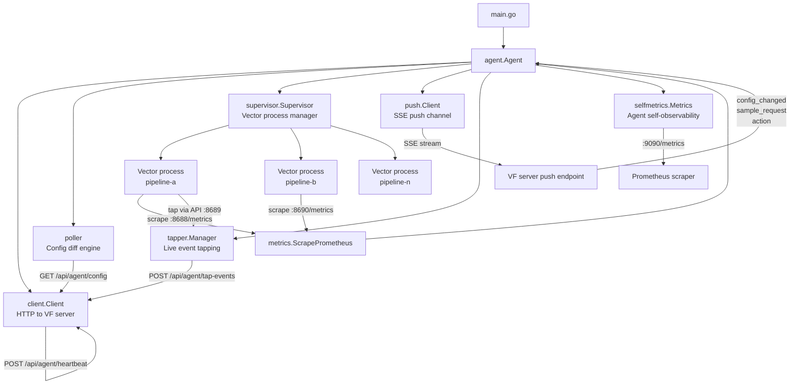

This document describes how the `vf-agent` binary is structured internally. It is aimed at operators who need a deep understanding of the agent's runtime behavior, and contributors working on the agent codebase.

For user-facing installation and configuration, see [Agent Reference](./agent).

---

## Component map



---

## Package responsibilities

| Package | Path | Responsibility |
|---------|------|----------------|
| `agent` | `internal/agent/` | Top-level orchestrator: enrollment, main event loop, push message routing, log flushing, sample collection |
| `client` | `internal/client/` | Typed HTTP client for all VF server endpoints (enroll, config, heartbeat, logs, samples, tap-events) |
| `config` | `internal/config/` | Environment variable parsing and validation |
| `supervisor` | `internal/supervisor/` | Spawns, monitors, and restarts Vector child processes; allocates ports; writes sidecar configs |
| `metrics` | `internal/metrics/` | Scrapes Vector's Prometheus endpoint and parses component/host/pipeline metrics |
| `selfmetrics` | `internal/selfmetrics/` | Tracks agent-internal health counters (poll errors, reconnects, heartbeat errors) and exposes them as a Prometheus endpoint |
| `push` | `internal/push/` | Maintains a persistent SSE connection to the server push endpoint with automatic reconnection and fallback URL support |
| `tapper` | `internal/tapper/` | Spawns `vector tap` subprocesses for live event inspection; streams results to the server |
| `sampler` | `internal/sampler/` | Runs `vector tap` for one-shot event sampling; extracts field schema from sampled events |
| `logbuf` | `internal/logbuf/` | Fixed-size ring buffer (500 lines) capturing stdout/stderr from each Vector process |

---

## Main event loop

The agent's `Run()` method executes a single goroutine select loop. This keeps the critical state machine single-threaded and eliminates the need for locks on most fields.

```
┌─────────────────────────────────────────────────────────────┐
│                       Run() select loop                      │
│                                                              │
│  ┌──────────────┐  ┌──────────────┐  ┌───────────────────┐  │
│  │  ticker.C    │  │  pushCh      │  │ immediateHeartbeat│  │
│  │  (poll       │  │  (SSE push   │  │ Ch               │  │
│  │   interval)  │  │   messages)  │  │ (debounced 1s)   │  │
│  └──────┬───────┘  └──────┬───────┘  └────────┬──────────┘  │
│         │                 │                    │             │
│         ▼                 ▼                    ▼             │
│   pollAndApply()    handlePushMessage()   sendHeartbeat()   │
│   sendHeartbeat()                                            │
└─────────────────────────────────────────────────────────────┘
```

The `immediateHeartbeatCh` debounces rapid push notifications — multiple `config_changed` events within one second collapse into a single heartbeat with the latest state.

---

## Process lifecycle in detail

### Startup sequence

```
main()
  │
  ├─ config.Load()            # parse all VF_* env vars
  ├─ agent.New(cfg)           # construct all subsystems
  │    ├─ client.New(url)
  │    ├─ supervisor.New(vectorBin)
  │    ├─ tapper.New(vectorBin)
  │    └─ selfmetrics.New(pipelinesRunningFn)
  │
  └─ agent.Run()
       ├─ loadOrEnroll()      # load node-token from disk or enroll with server
       ├─ (if VF_METRICS_PORT > 0) go metrics.Serve(port)
       ├─ pollAndApply()      # first poll immediately
       ├─ push.Client.Connect() → go routine
       ├─ runLogFlusher()     → go routine
       └─ sendHeartbeat()     # first heartbeat
```

### Pipeline start

```
pollAndApply()
  └─ poller.Poll()
       └─ returns ActionStart for new pipelines
            │
            └─ supervisor.Start(pipelineID, configPath, ...)
                 ├─ allocates metricsPort = basePort + (portSeq*2 - 1)
                 ├─ allocates apiPort     = basePort + (portSeq*2)
                 ├─ writeSidecarConfig()   → <configPath>.vf-metrics.yaml
                 ├─ exec.Command(vectorBin, --config, configPath,
                 │                         --config, sidecarPath)
                 └─ go monitor(info)       # goroutine watches for exit
```

### Crash recovery

```
monitor(info) goroutine
  ├─ time.Sleep(2s)           # startup grace period → sets status RUNNING
  ├─ cmd.Wait()               # blocks until process exits
  └─ if err != nil (crash):
       info.Status = "CRASHED"
       info.restarts++
       backoff = min(1s << (restarts-1), 60s)
       go func() {
           time.Sleep(backoff)
           startProcess(...)   # restart with same ports
       }()
```

Backoff sequence: 1s → 2s → 4s → 8s → 16s → 32s → 60s (capped).

---

## Port allocation

Each pipeline gets two consecutive TCP ports on `127.0.0.1`, allocated by a sequential counter starting at 8688:

| Pipeline | Prometheus metrics port | Vector API port |
|----------|------------------------|-----------------|
| First    | 8688                   | 8689            |
| Second   | 8690                   | 8691            |
| Third    | 8692                   | 8693            |
| N-th     | 8688 + (2N-2)          | 8688 + (2N-1)   |

The counter is **never reset** within a process lifetime. If a pipeline restarts (crash recovery or config change), it reuses the same ports it was originally allocated. If a pipeline is removed and a new one added, the new pipeline receives the next available ports in the sequence.

<Callout type="info">
Ports are allocated from a monotonically increasing sequence, never recycled. On a long-running agent with many pipeline additions/removals, the port sequence drifts upward. This is intentional — reusing ports too soon after a process exit can cause bind failures if the old process hasn't fully released the socket.
</Callout>

---

## Push vs. poll

The agent uses **both** SSE push and periodic polling, working together:

| Mechanism | Trigger | Purpose |
|-----------|---------|---------|
| Poll | Every `VF_POLL_INTERVAL` (default 15s) | Baseline reliability — ensures config is always eventually consistent |
| Push (SSE) | Server sends `config_changed` | Near-instant reaction to deploys (~200ms vs. up to 15s) |

**Push does not replace poll.** Push messages only trigger an immediate poll cycle — the full config is always fetched from the config endpoint, never embedded in push messages. This keeps the push channel lightweight and the agent logic simple.

**Push fallback**: If the primary push URL fails 3 times consecutively with short-lived connections, the agent switches to the derived fallback URL (`<VF_URL>/api/agent/push`). This handles cases where the server provides a WebSocket proxy URL that becomes unavailable.

**Push reconnection**: On any connection drop, the push client reconnects with exponential backoff (1s → 30s max). Each reconnection increments `vf_agent_push_reconnects_total`.

---

## SSE push message types

| Type | Payload | Action |
|------|---------|--------|
| `config_changed` | `pipelineId`, `reason` | Triggers an immediate `pollAndApply()` + debounced heartbeat |
| `sample_request` | `requestId`, `pipelineId`, `componentKeys`, `limit` | Launches `vector tap` for each component; results sent to `/api/agent/samples` |
| `tap_start` | `requestId`, `pipelineId`, `componentId` | Starts a long-running `vector tap` subprocess |
| `tap_stop` | `requestId` | Cancels a running tap subprocess |
| `action` | `action`, `targetVersion`, `downloadUrl`, `checksum` | Handles `self_update` or `restart` |
| `poll_interval` | `intervalMs` | Immediately resets the poll ticker |

---

## Metrics sidecar

Every pipeline launched by the supervisor gets a second Vector config file (`.vf-metrics.yaml`) merged in alongside the user's config. The sidecar adds three components:

```yaml
sources:
  vf_internal_metrics:       # Vector's own internal metrics
    type: internal_metrics
  vf_host_metrics:           # CPU, memory, disk, network from the host
    type: host_metrics

sinks:
  vf_metrics_exporter:       # Prometheus exporter for the agent to scrape
    type: prometheus_exporter
    inputs: ["vf_internal_metrics", "vf_host_metrics"]
    address: "127.0.0.1:<metricsPort>"

api:
  enabled: true
  address: "127.0.0.1:<apiPort>"  # Vector API for tap and sampling
```

The `vf_` prefix on component IDs is how the scraper distinguishes sidecar metrics from user pipeline metrics when computing pipeline totals.

---

## Agent self-metrics

As of v0.6.0, the agent exports its own health metrics at `:9090/metrics` (configurable via `VF_METRICS_PORT`):

| Metric | Type | Description |
|--------|------|-------------|
| `vf_agent_poll_errors_total` | counter | Failed poll requests to the VF server |
| `vf_agent_poll_duration_seconds` | gauge | Duration of the most recent poll cycle |
| `vf_agent_push_reconnects_total` | counter | SSE push channel reconnection events |
| `vf_agent_push_connected` | gauge | 1 if connected, 0 if disconnected |
| `vf_agent_heartbeat_errors_total` | counter | Failed heartbeat sends |
| `vf_agent_heartbeat_duration_seconds` | gauge | Duration of the most recent heartbeat send |
| `vf_agent_pipelines_running` | gauge | Number of pipelines currently RUNNING |
| `vf_agent_uptime_seconds` | gauge | Agent process uptime |

A subset of these (poll errors, reconnects, push connected, pipelines running, uptime) is embedded in every heartbeat payload as `agentHealth` for server-side visibility without requiring a Prometheus scrape.

---

## Configuration reference

All configuration is via environment variables. There are no config files.

| Variable | Default | Description |
|----------|---------|-------------|
| `VF_URL` | *(required)* | VectorFlow server URL |
| `VF_TOKEN` | *(required first run)* | Enrollment token (not needed after node-token is written to disk) |
| `VF_DATA_DIR` | `/var/lib/vf-agent` | Storage for node-token, pipeline configs, and cert files |
| `VF_VECTOR_BIN` | `vector` | Path to the Vector binary |
| `VF_POLL_INTERVAL` | `5s` | Poll cycle duration (Go duration syntax: `5s`, `1m`, `30s`) |
| `VF_LOG_FLUSH_INTERVAL` | `2s` | How often to flush pipeline log buffers to the server |
| `VF_LOG_LEVEL` | `info` | Agent log verbosity: `debug`, `info`, `warn`, `error` |
| `VF_NODE_LABELS` | *(none)* | Comma-separated `key=value` labels (e.g., `region=us-east-1,tier=prod`) |
| `VF_METRICS_PORT` | `9090` | Port for agent self-metrics Prometheus endpoint; set to `0` to disable |

---

## Concurrency model

The agent deliberately minimises shared mutable state:

- **Main goroutine** owns the event loop, `pollAndApply()`, and `sendHeartbeat()`. No locks needed for most fields.
- **`supervisor.Supervisor`** uses a single `sync.Mutex` protecting its `processes` map and port counter.
- **`sampleResults`** is the only field in `Agent` that is written from goroutines spawned by `processSampleRequests`. Protected by `Agent.mu`.
- **`selfmetrics.Metrics`** uses `sync/atomic` for all counters and the push-connected gauge. Mutex only for the float64 duration gauges (atomic float64 requires wider-than-pointer-width CAS on 32-bit platforms).
- **`push.Client`** uses a single mutex to protect the context cancel function.

**Race detector**: All packages are tested with `go test -race ./...`.
