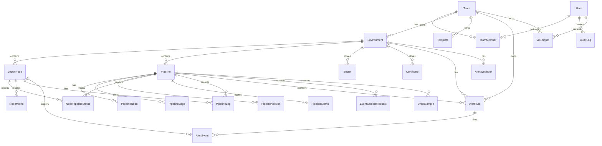

<Callout type="info">
This reference is for advanced self-hosters who need to understand the data model for backup planning, integrations, or troubleshooting. The schema is managed by Prisma migrations -- you do not need to create tables manually. Running `npx prisma migrate deploy` (or starting the Docker container) applies all pending migrations automatically.
</Callout>

VectorFlow uses **PostgreSQL** as its sole data store. All state -- pipeline definitions, fleet status, metrics, audit logs, secrets, and user accounts -- lives in the database.

---

## Entity relationship diagram

---

## Core entities

| Table | Description |
|-------|-------------|
| `User` | User accounts with authentication credentials, TOTP secrets, and super admin flag |
| `Team` | Organizational unit that groups environments, templates, and members |
| `TeamMember` | Join table linking users to teams with a role (VIEWER, EDITOR, ADMIN) |
| `Environment` | Logical grouping of nodes and pipelines (e.g., Production, Staging) |
| `VectorNode` | An agent node registered in an environment |
| `Pipeline` | A pipeline definition with its visual graph, deployment state, and global config |
| `PipelineNode` | A single component (source, transform, or sink) within a pipeline graph |
| `PipelineEdge` | A connection between two pipeline nodes |
| `PipelineVersion` | An immutable snapshot of a pipeline's generated YAML config at deploy time |
| `NodePipelineStatus` | Per-node runtime status for a deployed pipeline |
| `PipelineMetric` | Time-series pipeline throughput data (events, bytes, errors) |
| `NodeMetric` | Time-series host system metrics (CPU, memory, disk, network) |
| `PipelineLog` | Log lines from pipeline processes, forwarded by agents |
| `Secret` | Encrypted secret values scoped to an environment |
| `Certificate` | Encrypted TLS certificate files scoped to an environment |
| `Template` | Reusable pipeline template stored as JSON nodes/edges |
| `AuditLog` | Immutable record of every significant action |
| `SystemSettings` | Singleton row for global server configuration |
| `AlertRule` | Alert condition definition (metric, threshold, duration) |
| `AlertWebhook` | Webhook destination for alert notifications |
| `AlertEvent` | Record of a fired or resolved alert |
| `VrlSnippet` | Custom VRL code snippet in the team library |
| `EventSampleRequest` | Request to sample live events from a running pipeline |
| `EventSample` | Sampled event data and inferred schema for a pipeline component |
| `Account` | OAuth/OIDC provider accounts linked to users |

---

## Key table details

### Pipeline

The central entity. Stores the pipeline definition and tracks deployment state.

| Field | Type | Description |
|-------|------|-------------|
| `id` | `String` (CUID) | Primary key |
| `name` | `String` | Display name |
| `description` | `String?` | Optional description |
| `environmentId` | `String` | FK to Environment |
| `globalConfig` | `Json?` | Global Vector config (API settings, enrichment tables, log level) |
| `isDraft` | `Boolean` | `true` = not deployed, `false` = actively deployed |
| `isSystem` | `Boolean` | `true` = system pipeline (audit log shipping) |
| `deployedAt` | `DateTime?` | Timestamp of last deployment (null if never deployed) |
| `createdById` | `String?` | FK to User who created the pipeline |
| `updatedById` | `String?` | FK to User who last modified the pipeline |
| `createdAt` | `DateTime` | Creation timestamp |
| `updatedAt` | `DateTime` | Last modification timestamp |

Relationships: `nodes`, `edges`, `versions`, `nodeStatuses`, `metrics`, `pipelineLogs`, `alertRules`, `sampleRequests`, `eventSamples`.

### VectorNode

Represents an enrolled agent node.

| Field | Type | Description |
|-------|------|-------------|
| `id` | `String` (CUID) | Primary key |
| `name` | `String` | Display name (defaults to hostname at enrollment) |
| `host` | `String` | Hostname or IP address |
| `apiPort` | `Int` | Vector API port (default: 8686) |
| `environmentId` | `String` | FK to Environment |
| `status` | `NodeStatus` | Current health: `HEALTHY`, `DEGRADED`, `UNREACHABLE`, `UNKNOWN` |
| `lastSeen` | `DateTime?` | Last time the server processed a heartbeat from this node |
| `metadata` | `Json?` | Additional node metadata |
| `nodeTokenHash` | `String?` | Hashed node authentication token (null = revoked) |
| `enrolledAt` | `DateTime?` | When the node first enrolled |
| `lastHeartbeat` | `DateTime?` | Timestamp of the last heartbeat |
| `agentVersion` | `String?` | Reported agent binary version |
| `vectorVersion` | `String?` | Reported Vector binary version |
| `os` | `String?` | Operating system and architecture (e.g., `linux/amd64`) |
| `deploymentMode` | `DeploymentMode` | `STANDALONE`, `DOCKER`, or `UNKNOWN` |
| `maintenanceMode` | `Boolean` | Whether the node is in maintenance mode (pipelines are stopped) |
| `maintenanceModeAt` | `DateTime?` | When the node entered maintenance mode (null if not in maintenance) |
| `pendingAction` | `Json?` | Server-initiated action (e.g., self-update command) |
| `createdAt` | `DateTime` | Registration timestamp |

### Environment

Logical grouping that contains nodes, pipelines, secrets, and certificates.

| Field | Type | Description |
|-------|------|-------------|
| `id` | `String` (CUID) | Primary key |
| `name` | `String` | Display name (e.g., "Production", "Staging") |
| `isSystem` | `Boolean` | `true` = internal system environment (hidden from UI) |
| `teamId` | `String?` | FK to Team (null for system environment) |
| `enrollmentTokenHash` | `String?` | Hashed enrollment token for agent registration |
| `enrollmentTokenHint` | `String?` | First few characters of the token for display |
| `secretBackend` | `SecretBackend` | Secret storage: `BUILTIN`, `VAULT`, `AWS_SM`, `EXEC` |
| `secretBackendConfig` | `Json?` | Configuration for external secret backends |
| `gitRepoUrl` | `String?` | HTTPS URL of the Git repository for pipeline audit trail |
| `gitBranch` | `String?` | Git branch to commit pipeline YAML to (default: `main`) |
| `gitToken` | `String?` | Encrypted access token for Git repository authentication |
| `createdAt` | `DateTime` | Creation timestamp |

### PipelineVersion

Immutable deployment snapshot. Created each time a pipeline is deployed.

| Field | Type | Description |
|-------|------|-------------|
| `id` | `String` (CUID) | Primary key |
| `pipelineId` | `String` | FK to Pipeline |
| `version` | `Int` | Auto-incrementing version number |
| `configYaml` | `String` | The generated Vector YAML config |
| `configToml` | `String?` | Optional TOML representation |
| `logLevel` | `String?` | Vector log level at deploy time |
| `globalConfig` | `Json?` | Global config snapshot |
| `createdById` | `String` | FK to User who deployed |
| `changelog` | `String?` | User-provided deploy message |
| `createdAt` | `DateTime` | Deploy timestamp |

### Secret

Encrypted secrets scoped to an environment. Referenced in pipeline configs using `SECRET[name]` syntax.

| Field | Type | Description |
|-------|------|-------------|
| `id` | `String` (CUID) | Primary key |
| `name` | `String` | Secret identifier (unique per environment) |
| `encryptedValue` | `String` | AES-256-GCM encrypted value |
| `environmentId` | `String` | FK to Environment |
| `createdAt` | `DateTime` | Creation timestamp |
| `updatedAt` | `DateTime` | Last update timestamp |

### Certificate

Encrypted TLS certificate files. Referenced in pipeline configs using `CERT[name]` syntax.

| Field | Type | Description |
|-------|------|-------------|
| `id` | `String` (CUID) | Primary key |
| `name` | `String` | Certificate identifier (unique per environment) |
| `filename` | `String` | Original filename (e.g., `ca.pem`) |
| `fileType` | `String` | Type: `ca`, `cert`, or `key` |
| `encryptedData` | `String` | AES-256-GCM encrypted PEM content |
| `environmentId` | `String` | FK to Environment |
| `createdAt` | `DateTime` | Upload timestamp |

### AuditLog

Immutable audit trail of all significant actions.

| Field | Type | Description |
|-------|------|-------------|
| `id` | `String` (CUID) | Primary key |
| `userId` | `String?` | FK to User (null for system actions) |
| `action` | `String` | Action identifier (e.g., `pipeline.created`, `deploy.agent`) |
| `entityType` | `String` | Target entity type (e.g., `Pipeline`, `Environment`) |
| `entityId` | `String` | ID of the affected entity |
| `diff` | `Json?` | Before/after field changes |
| `metadata` | `Json?` | Additional context |
| `ipAddress` | `String?` | Client IP address |
| `userEmail` | `String?` | Denormalized email for display |
| `userName` | `String?` | Denormalized name for display |
| `teamId` | `String?` | Owning team |
| `environmentId` | `String?` | Owning environment |
| `createdAt` | `DateTime` | Timestamp |

---

## Enums

| Enum | Values | Description |
|------|--------|-------------|
| `Role` | `VIEWER`, `EDITOR`, `ADMIN` | Team membership role |
| `AuthMethod` | `LOCAL`, `OIDC` | User authentication method |
| `NodeStatus` | `HEALTHY`, `DEGRADED`, `UNREACHABLE`, `UNKNOWN` | Agent node health |
| `DeploymentMode` | `STANDALONE`, `DOCKER`, `UNKNOWN` | How the agent is deployed |
| `ComponentKind` | `SOURCE`, `TRANSFORM`, `SINK` | Pipeline node category |
| `ProcessStatus` | `RUNNING`, `STARTING`, `STOPPED`, `CRASHED`, `PENDING` | Pipeline process state |
| `LogLevel` | `TRACE`, `DEBUG`, `INFO`, `WARN`, `ERROR` | Log severity |
| `SecretBackend` | `BUILTIN`, `VAULT`, `AWS_SM`, `EXEC` | Secret storage provider |
| `AlertMetric` | `node_unreachable`, `cpu_usage`, `memory_usage`, `disk_usage`, `error_rate`, `discarded_rate`, `pipeline_crashed` | Metric to evaluate |
| `AlertCondition` | `gt`, `lt`, `eq` | Comparison operator |
| `AlertStatus` | `firing`, `resolved` | Alert event state |

---

## Encryption at rest

Sensitive fields are encrypted using AES-256-GCM before being stored in the database:

- **Secret values** (`Secret.encryptedValue`) -- pipeline credentials, API keys, passwords
- **Certificate data** (`Certificate.encryptedData`) -- TLS certificates and private keys
- **TOTP secrets** (`User.totpSecret`) -- two-factor authentication secrets
- **TOTP backup codes** (`User.totpBackupCodes`) -- recovery codes
- **Password hashes** (`User.passwordHash`) -- bcrypt-hashed, not AES-encrypted

The encryption key is derived from the `NEXTAUTH_SECRET` environment variable. Losing this value means encrypted data cannot be recovered.

---

## Indexes

Key database indexes for query performance:

| Table | Index | Purpose |
|-------|-------|---------|
| `PipelineMetric` | `(pipelineId, timestamp)` | Time-range queries for pipeline charts |
| `PipelineMetric` | `(timestamp)` | Retention cleanup |
| `NodeMetric` | `(nodeId, timestamp)` | Time-range queries for node charts |
| `PipelineLog` | `(pipelineId, timestamp)` | Pipeline log pagination |
| `PipelineLog` | `(nodeId, timestamp)` | Node log pagination |
| `AuditLog` | `(entityType, entityId)` | Entity-specific audit queries |
| `AuditLog` | `(userId)` | User activity queries |
| `AuditLog` | `(createdAt)` | Time-range audit queries |
| `AlertRule` | `(environmentId)` | Environment-scoped alert listing |
| `AlertEvent` | `(alertRuleId)` | Alert event history |
| `AlertEvent` | `(firedAt)` | Time-range alert queries |

---

## Data retention

VectorFlow automatically prunes time-series data based on system settings:

| Data Type | Default Retention | Setting |
|-----------|------------------|---------|
| Pipeline metrics | 7 days | `metricsRetentionDays` |
| Pipeline logs | 3 days | `logsRetentionDays` |
| Node metrics | 7 days | `metricsRetentionDays` |
| Audit logs | Indefinite | Not automatically pruned |
| Alert events | Indefinite | Not automatically pruned |

These values are configured in the `SystemSettings` table via the admin UI.

---

## Backup considerations

<Callout type="warn">
The database is the single source of truth for all VectorFlow state. Losing the database without a backup means losing all pipeline definitions, deployment history, secrets, and audit logs.
</Callout>

For backup and restore procedures, see [Backup & Restore](../operations/backup-restore).

Key points:
- Use `pg_dump` for logical backups or continuous archiving for point-in-time recovery
- The `NEXTAUTH_SECRET` environment variable must match between backup and restore -- it is the encryption key for secrets and certificates
- VectorFlow has built-in scheduled backup support (configured via `SystemSettings`)
